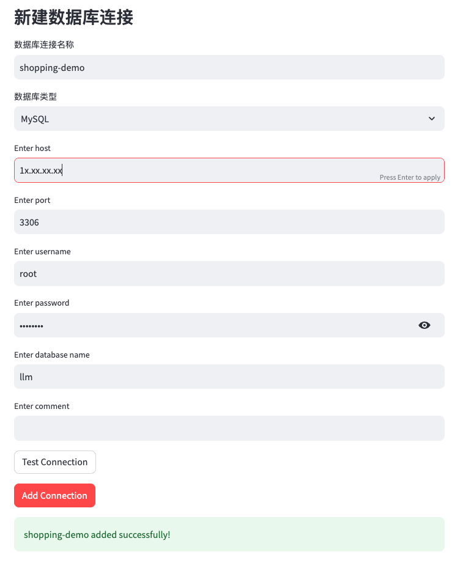
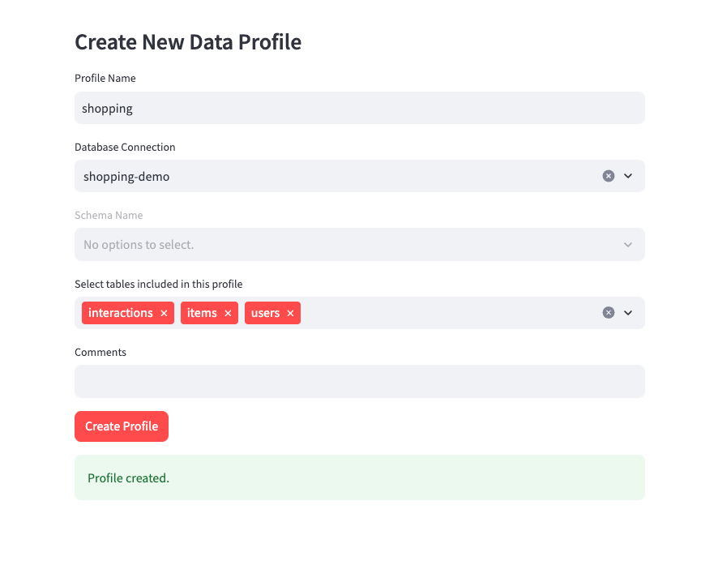
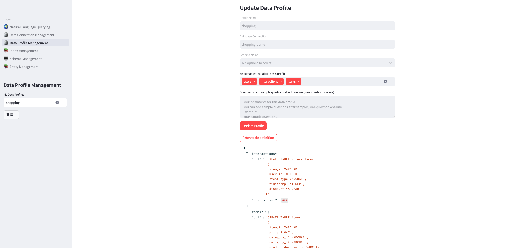
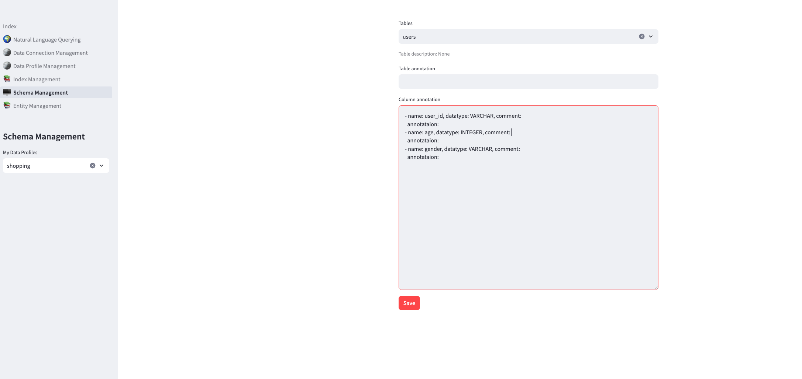
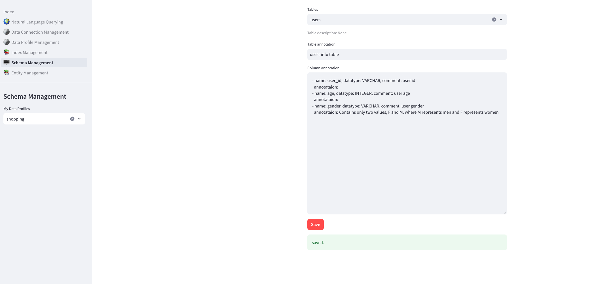
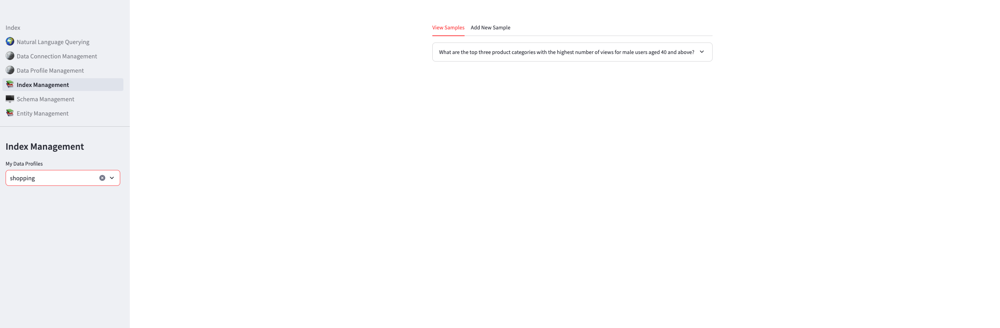

# Generative BI using RAG on AWS
[中文文档](README_CN.md)

This is a comprehensive framework designed to enable Generative BI capabilities on customized data sources (RDS/Redshift) hosted on AWS. It offers the following key features:
- Text-to-SQL functionality for querying customized data sources using natural language.
- User-friendly interface for adding, editing, and managing data sources, tables, and column descriptions.
- Performance enhancement through the integration of historical question-answer ranking and entity recognition.
- Intuitive question-answering UI that provides insights into the underlying Text-to-SQL mechanism.
- Simple agent design interface for handling complex queries through a conversational approach.

## Introduction

A NLQ(Natural Language Query) demo using Amazon Bedrock, Amazon OpenSearch with RAG technique.


[User Operation Manual](https://github.com/aws-samples/generative-bi-using-rag/wiki/%E7%94%A8%E6%88%B7%E6%93%8D%E4%BD%9C%E6%89%8B%E5%86%8C)

[Project Data Flowchart](https://github.com/aws-samples/generative-bi-using-rag/wiki/%E9%A1%B9%E7%9B%AE%E6%B5%81%E7%A8%8B%E5%9B%BE)


## Deployment Guide

### 1. Prepare EC2 Instance
Create an EC2 with following configuration:

    - OS Image (AMI): Amazon Linux 2023, Amazon Linux 2(AL2 End of Life is 2025-06-30)
    - Instance type: t3.large or higher
    - VPC: use default one and choose a public subnet
    - Security group: Allow access to 22, 80, 8000 port from anywhere (Select "Allow SSH traffic from Anywhere" and "Allow HTTP traffic from the internet")
    - Storage (volumes): 1 GP3 volume(s) - 30 GiB

### 2. Config Permission

2.1 IAM Role's permission

Create a new IAM role with name genbirag-service-role and settings below:
   - Trusted entity type: AWS Service
   - Service: EC2
   - Use Case: EC2 - Allows EC2 instances to call AWS services on your behalf.

Skip "Add permission" and create this role first.

After the role is created, and then add permission by creating inline policy as below:
```json
{
    "Version": "2012-10-17",
    "Statement": [
        {
            "Sid": "VisualEditor0",
            "Effect": "Allow",
            "Action": [
                "bedrock:*",
                "dynamodb:*"
            ],
            "Resource": "*"
        }
    ]
}
```

Finally, Bind this IAM instance profile (IAM Role) to your EC2 instance.

2.2 Amazon Bedrock's Model Permission

Make sure you have enabled model access in AWS Console in us-west-2 (Oregon) region for Anthropic Claude model and Amazon Titan embedding model.


### 3. Install Docker and Docker Compose

Log in to the EC2 instance using SSH command as the ec2-user user or use the AWS EC2 Instance Connect feature in the EC2 console to log in to the command line. 

In the session, execute the following commands. **Note: Execute each command one line at a time.**

If you are not this user, you can switch with the following command: 
```bash
sudo su - ec2-user
```

```bash  
# Install components
sudo yum install docker python3-pip git -y && pip3 install -U awscli && pip3 install docker-compose

# For Amazon Linux 2，use yum to replace dnf

sudo yum install docker python3-pip git -y && pip3 install -U awscli && sudo pip3 install docker-compose

# Fix docker python wrapper 7.0 SSL version issue  
pip3 install docker==6.1.3

# Configure components
sudo systemctl enable docker && sudo systemctl start docker && sudo usermod -aG docker $USER

# Exit the terminal
exit
```

### 4. Install the Demo Application

Reopen a terminal session and continue executing the following commands:

Note: Execute each command one line at a time.

```bash
# Log in as user ec2-user

# Configure OpenSearch server parameters
sudo sh -c "echo 'vm.max_map_count=262144' > /etc/sysctl.conf" && sudo sysctl -p

# Clone the code
git clone https://github.com/aws-samples/generative-bi-using-rag.git

# Config the Environment Variable in .env file, modify AWS_DEFAULT_REGION to the region same as the EC2 instance.
cd generative-bi-using-rag/application && cp .env.template .env 

# Build docker images locally
docker-compose build

# Start all services
docker-compose up -d

# Wait 3 minutes for MySQL and OpenSearch to initialize
sleep 180
```

### 5. Initialize MySQL

In the terminal, continue executing the following commands:

```bash
cd initial_data && wget https://github.com/fengxu1211/generative-bi-using-rag/raw/demo_data/application/initial_data/init_mysql_db.sql.zip

unzip init_mysql_db.sql.zip && cd ..

docker exec nlq-mysql sh -c "mysql -u root -ppassword -D llm  < /opt/data/init_mysql_db.sql" 
```

### 6. Initialize Amazon OpenSearch docker version

6.1 Initialize the index for the sample data by creating a new index:

```bash 
docker exec nlq-webserver python opensearch_deploy.py
```

If the command fails due to any errors, delete the index and rerun the previous command:

```bash
curl -XDELETE -k -u admin:admin "https://localhost:9200/uba"
```

6.2 (Optional) Bulk import custom QA data by appending to an existing index: 

```bash
docker exec nlq-webserver python opensearch_deploy.py custom false
```

### 7. Access the Streamlit Web UI

Open in your browser: `http://<your-ec2-public-ip>`

Note: Use HTTP instead of HTTPS. 

### 8. Access the API

Open in your browser: `http://<your-ec2-public-ip>:8000`

Note: Use HTTP instead of HTTPS. 

the default account is

```
username: admin
password: awsadmin
```

if you want change the password or add username, you can change the 

application/config_files/stauth_config.yaml

for example 

```yaml
credentials:
  usernames:
    jsmith:
      email: jsmith@gmail.com
      name: John Smith
      password: abc # To be replaced with hashed password
    rbriggs:
      email: rbriggs@gmail.com
      name: Rebecca Briggs
      password: def # To be replaced with hashed password
cookie:
  expiry_days: 30
  key: random_signature_key # Must be string
  name: random_cookie_name
preauthorized:
  emails:
  - melsby@gmail.com
```

change the password to hashed password

```python
from streamlit_authenticator.utilities.hasher import Hasher
hashed_passwords = Hasher(['abc', 'def']).generate()
```


## CDK Deployment Guide

### 1. Prepare CDK Pre-requisites

Please follow the instructions in the [CDK Workshop](https://cdkworkshop.com/15-prerequisites.html) to install the CDK toolkit.

### 2. Prepare SageMaker Model Assets(For China Region)
Before deploying the CDK stack, you need to prepare the SageMaker model assets in the S3 bucket.

```bash
cd generative-bi-using-rag/source/model
bash prepare_model.sh -s <s3_bucket_name>
```

### 2. Deploy the CDK Stack

For global regions, execute the following commands:
```bash
cd generative-bi-using-rag/source/resources
npm install
npx cdk deploy
```

For China regions, execute the following commands:
```bash
cd generative-bi-using-rag/source/resources
npm install
npx cdk deploy --parameters S3ModelAssetsBucket=<s3_bucket_name>
```

### 3. Access the Streamlit Web UI
After the CDK stack is deployed, wait around 10 minutes for the initialization to complete. Then, open the Streamlit Web UI in your browser: `http://<your-ec2-public-ip>`

Note: Use HTTP instead of HTTPS. 

## How to use custom data sources with the demo app
1. First create the corresponding Data Profile in Data Connection Management and Data Profile Management.



2. After selecting the Data Profile, start asking questions. For simple questions, the LLM can directly generate the correct SQL. If the generated SQL is incorrect, try adding more annotations to the Schema.  



Then Refresh This Webpage, Click Fetch table definition 




3. Use the Schema Management page, select the Data Profile, and add comments to the tables and fields. These comments will be included in the prompt sent to the LLM.
   (1) For some fields, add values to the Annotation attribute, e.g. "Values: Y|N", "Values: Shanghai|Jiangsu".
   (2) For table comments, add domain knowledge to help answer business questions.






4. Ask the question again. If still unable to generate the correct SQL, add Sample QA pairs to OpenSearch.
   (1) Using the Index Management page, select the Data Profile then you can add, view and delete QA pairs.

 

5. Ask again. In theory, the RAG approach (PE uses Few shots) should now be able to generate the correct SQL.

## Security

See [CONTRIBUTING](CONTRIBUTING.md#security-issue-notifications) for more information.

## License

This library is licensed under the MIT-0 License. See the LICENSE file.

