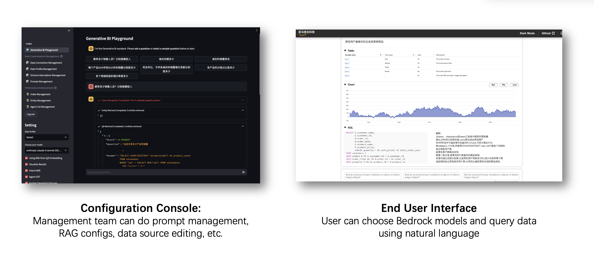
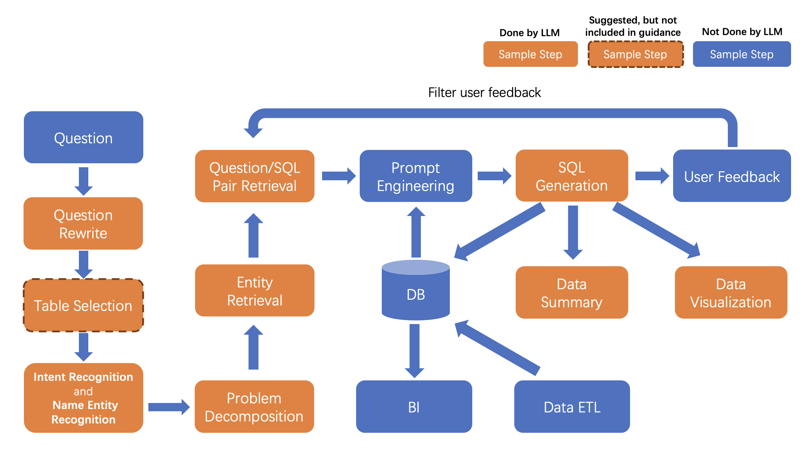

# Generative BI using RAG on AWS
[中文文档](README_CN.md) | [日本語ドキュメント](README_JP.md)

The deployment guide here is CDK only. For manual deployment or detailed guide, refer to [Manual Deployment Guide in Chinese](https://github.com/aws-samples/generative-bi-using-rag/wiki/%E8%B0%83%E8%AF%95%E7%95%8C%E9%9D%A2%E4%BB%A5%E5%8F%8AAPI%E9%83%A8%E7%BD%B2)


## Introduction

A Generative BI  demo using Amazon Bedrock, Amazon OpenSearch with RAG technique.


*Reference Architecture on AWS*


*Design Logic*

[User Operation Manual](https://github.com/aws-samples/generative-bi-using-rag/wiki/%E7%B3%BB%E7%BB%9F%E7%AE%A1%E7%90%86%E5%91%98%E6%93%8D%E4%BD%9C)

[Project Data Flowchart](https://github.com/aws-samples/generative-bi-using-rag/wiki/%E6%9E%B6%E6%9E%84%E5%9B%BE)

## Table of Content
1. [Overview](#overview)
    - [Cost](#cost)
2. [Prerequisites](#prerequisites)
    - [Operating System](#operating-system)
3. [Workshop](#workshop)
4. [Deployment Steps](#deployment-steps)
5. [Deployment Validation](#deployment-validation)
6. [Running the Guidance](#running-the-guidance)
7. [Next Steps](#next-steps)
8. [Cleanup](#cleanup)

## Overview
This is a comprehensive framework designed to enable Generative BI capabilities on customized data sources (RDS/Redshift) hosted on AWS. It offers the following key features:
- Text-to-SQL functionality for querying customized data sources using natural language.
- User-friendly interface for adding, editing, and managing data sources, tables, and column descriptions.
- Performance enhancement through the integration of historical question-answer ranking and entity recognition.
- Customize business information, including entity information, formulas, SQL samples, and analysis ideas for complex business problems.
- Add agent task splitting function to handle complex attribution analysis problems.
- Intuitive question-answering UI that provides insights into the underlying Text-to-SQL mechanism.
- Simple agent design interface for handling complex queries through a conversational approach.

### Cost

As of May, 2024, the cost for running this Guidance with the default settings in the _us-west-2_ is approximately $1337.8 per month for processing 2000 requests.

### Sample Cost Table

The following table provides a sample cost breakdown for deploying this Guidance with the default parameters in the US East (N. Virginia) Region for one month.

| AWS service  | Dimensions | Cost [USD] per Month |
| ----------- | ------------ | ------------ |
| Amazon ECS | v0.75 CPU 5GB | $11.51 |
| Amazon DynamoDB | 25 provisioned write & read capacity units per month | $ 14.04 |
| Amazon Bedrock | 2000 requests per month, with each request consuming 10000 input tokens and 1000 output tokens | $ 90.00 |
| Amazon OpenSearch Service | 1 domain with m5.large.search | $ 103.66 |

## Prerequisites

### Operating System
“CDK are optimized to best work to be initiated on **<Amazon Linux 2023 AMI>**.  Deployment in another OS may require additional steps.”

### AWS account requirements

- VPC
- IAM role with specific permissions
- Amazon Bedrock
- Amazon ECS
- Amazon DynamoDB
- Amazon Cognito
- Amazon OpenSearch Service
- Amazon Elastic Load Balancing
- Amazon SageMaker (Optional, if you need customized models to be deployed)
- Amazon Secrets Manager

### Supported Regions

us-west-2, us-east-2, us-east-1, ap-south-1, ap-southeast-1, ap-southeast-2, ap-northeast-1, eu-central-1, eu-west-1, eu-west-3, or any other region that supports the services (bedrock) used in the Guidance.

## WorkShop

For more detailed usage instructions, please refer to the workshop below.

🔥🔥🔥 [The Workshop Content](https://catalog.us-east-1.prod.workshops.aws/workshops/37b20322-fc96-4716-8e51-4568b0641448)

## Deployment Steps

### 1. Prepare CDK Pre-requisites
Please follow the instructions in the [CDK Workshop](https://cdkworkshop.com/15-prerequisites.html) to install the CDK toolkit. Make sure your environment have the authorization to create the resources.

### 2. Set a password for the GenBI Admin Web UI

The default password is [Empty] for GenBI Admin Web UI. If you need to set a password for the GenBI Admin Web UI, you can update the password in the
```application/config_files/stauth_config.yaml```

for example 

```yaml
credentials:
  usernames:
    jsmith:
      email: jsmith@gmail.com
      name: John Smith
      password: XXXXXX # To be replaced with hashed password
    rbriggs:
      email: rbriggs@gmail.com
      name: Rebecca Briggs
      password: XXXXXX # To be replaced with hashed password
cookie:
  expiry_days: 30
  key: random_signature_key # Must be string
  name: random_cookie_name
preauthorized:
  emails:
  - melsby@gmail.com
```

change the password 'XXXXXX' to hashed password

Use the python code below to generate XXXXXX. We need python 3.8 and up to run the code below:
```python
from streamlit_authenticator.utilities.hasher import Hasher
hashed_passwords = Hasher(['password123']).generate()
```

### 3. Deploy the CDK Stack
For global regions, execute the following commands:

Navigate to the CDK project directory:
```
cd generative-bi-using-rag/source/resources

npm install aws-cdk-lib
```
Deploy the CDK stack, change the region to your own region if needed, for example, us-west-2, us-east-1, etc.:
```
export AWS_ACCOUNT_ID=XXXXXXXXXXXX
export AWS_REGION=us-west-2

cdk bootstrap aws://$AWS_ACCOUNT_ID/$AWS_REGION 
cdk deploy GenBiMainStack --require-approval never
```
You will see the following when deployed succeeded
```
GenBiMainStack.AOSDomainEndpoint = XXXXX.us-west-2.es.amazonaws.com
GenBiMainStack.APIEndpoint = XXXXX.us-west-2.elb.amazonaws.com
GenBiMainStack.FrontendEndpoint = XXXXX.us-west-2.elb.amazonaws.com
GenBiMainStack.StreamlitEndpoint = XXXXX.us-west-2.elb.amazonaws.com
```

## Running the Guidance 

After the CDK stack is deployed, wait around 40 minutes for the initialization to complete. Then, open the Web UI in your browser: https://your-public-dns

## Cleanup 
- Delete the CDK stack:
```
cdk destroy GenBiMainStack
```
