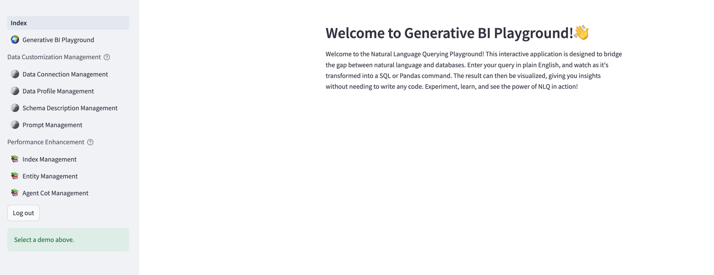
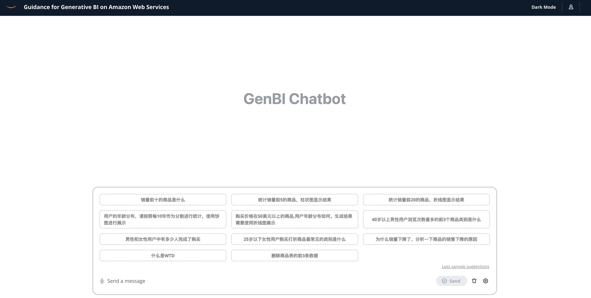

# 生成式BI演示应用

## 1、介绍

这是一个在AWS上针对自定义数据源(RDS/Redshift)启用生成式BI功能的框架。它提供以下关键特性:

- 通过自然语言查询自定义数据源的Text-to-SQL功能。
- 用户友好的界面,可添加、编辑和管理数据源、表和列描述。
- 通过集成历史问题答案排名和实体识别来提高性能。
- 自定义业务信息，包括实体信息，公式，SQL样本，复杂业务问题分析思路等。
- 增加agent任务拆分功能，能够处理复杂的归因分析问题。
- 直观的问答界面,可深入了解底层的Text-to-SQL机制。
- 简单的代理设计界面,可通过对话方式处理复杂查询。

使用该框架,您可以利用自然语言处理和生成式人工智能的力量,无缝地与数据源进行交互,从而实现更高效的数据探索和分析。

- 后台调试界面

- 用户终端界面

- 系统架构图

## 2、部署指南以及用户操作指南

本节主要包含以下内容

- 调试界面以及API部署/系统管理员用户操作指南

- 终端用户界面部署/终端用户操作指南

### 2-1、调试界面部署以及操作指南

调试界面，主要针对系统管理员，主要的功能是进行系统配置，进行效果优化

- 数据库连接配置
  - MySQL
  - Redshift
  - PostgreSQL
- 数据表说明配置
- 创建不同的业务线数据集合
- 提示词配置
- 业务知识库配置
- 更详细的Log信息

详细的信息，请查看下面的链接

[调试界面部署指南](https://github.com/aws-samples/generative-bi-using-rag/wiki/%E8%B0%83%E8%AF%95%E7%95%8C%E9%9D%A2%E4%BB%A5%E5%8F%8AAPI%E9%83%A8%E7%BD%B2)

[调试界面操作指南](https://github.com/aws-samples/generative-bi-using-rag/wiki/%E7%B3%BB%E7%BB%9F%E7%AE%A1%E7%90%86%E5%91%98%E6%93%8D%E4%BD%9C)

### 2-2、终端用户界面部署以及操作指南

终端用户界面，跟调试界面的区别是

- 只能进行数据查询，无法进行数据配置
- 更美观的终端界面
- 更友好的交互体验

详细的信息，请查看下面的链接

[用户界面部署指南](https://github.com/aws-samples/generative-bi-using-rag/wiki/%E7%BB%88%E7%AB%AF%E7%94%A8%E6%88%B7%E4%BD%BF%E7%94%A8%E7%95%8C%E9%9D%A2%E9%83%A8%E7%BD%B2)

[用户界面操作指南](https://github.com/aws-samples/generative-bi-using-rag/wiki/%E7%BB%88%E7%AB%AF%E7%94%A8%E6%88%B7%E6%93%8D%E4%BD%9C)

## 3、Security

See [CONTRIBUTING](CONTRIBUTING.md#security-issue-notifications) for more information.

## 4、License

This library is licensed under the MIT-0 License. See the LICENSE file.
