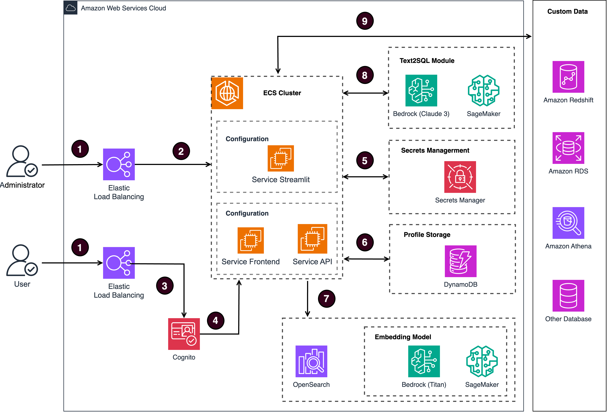

# AWS上的生成式BI应用 

## 1、介绍


这是一个在AWS上使用 Amazon Bedrock、Amazon OpenSearch 和 RAG 技术的生成式BI应用。


- 系统架构图




- 数据流程图


[用户操作手册](https://github.com/aws-samples/generative-bi-using-rag/wiki/%E7%B3%BB%E7%BB%9F%E7%AE%A1%E7%90%86%E5%91%98%E6%93%8D%E4%BD%9C)

[项目数据流程图](https://github.com/aws-samples/generative-bi-using-rag/wiki/%E6%9E%B6%E6%9E%84%E5%9B%BE)


## 目录

1. [Overview](#overview)
    - [Cost](#cost)
2. [Prerequisites](#prerequisites)
    - [Operating System](#operating-system)
3. [Workshop](#workshop)
4. [Deployment Steps](#deployment-steps)
5. [Deployment Validation](#deployment-validation)
6. [Running the Guidance](#running-the-guidance)
7. [Next Steps](#next-steps)
8. [Cleanup](#cleanup)

## 概述


这是一个在AWS上针对自定义数据源(RDS/Redshift)启用生成式BI功能的框架。它提供以下关键特性:

- 通过自然语言查询自定义数据源的Text-to-SQL功能。
- 用户友好的界面,可添加、编辑和管理数据源、表和列描述。
- 通过集成历史问题答案排名和实体识别来提高性能。
- 自定义业务信息，包括实体信息，公式，SQL样本，复杂业务问题分析思路等。
- 增加agent任务拆分功能，能够处理复杂的归因分析问题。
- 直观的问答界面,可深入了解底层的Text-to-SQL机制。
- 简单的代理设计界面,可通过对话方式处理复杂查询。


### 费用

截至2024年5月，在 us-west-2 区域使用默认设置运行这个 Guidance 的成本大约为每月$1337.8，处理2000个请求。


### 费用示例

下表提供了在美国东部(弗吉尼亚北部)地区部署此 Guidance 时，使用默认参数一个月的样本成本明细。


| AWS service  | Dimensions | Cost [USD] per Month |
| ----------- | ------------ | ------------ |
| Amazon ECS | v0.75 CPU 5GB | $11.51 |
| Amazon DynamoDB | 25 provisioned write & read capacity units per month | $ 14.04 |
| Amazon Bedrock | 2000 requests per month, with each request consuming 10000 input tokens and 1000 output tokens | $ 90.00 |
| Amazon OpenSearch Service | 1 domain with m5.large.search | $ 103.66 |


### 前提条件

### 操作系统

CDK 经过优化，最适合在 **Amazon Linux 2023 AMI** 上启动。在其他操作系统上部署可能需要额外的步骤。

### AWS 账户要求

- VPC
- IAM role with specific permissions
- Amazon Bedrock
- Amazon ECS
- Amazon DynamoDB
- Amazon Cognito
- Amazon OpenSearch Service
- Amazon Elastic Load Balancing
- Amazon SageMaker (Optional, if you need customized models to be deployed)
- Amazon Secrets Manager

### 支持的区域

us-west-2, us-east-2, us-east-1, ap-south-1, ap-southeast-1, ap-southeast-2, ap-northeast-1, eu-central-1, eu-west-1, eu-west-3, 以及其他支持bedrock的区域

## Workshop

更多更详细的使用说明，请查看下方的Workshop

🔥🔥🔥 [The Workshop Content](https://catalog.us-east-1.prod.workshops.aws/workshops/37b20322-fc96-4716-8e51-4568b0641448)


## 部署步骤

### 1. 准备 CDK 先决条件

请按照 [CDK Workshop](https://cdkworkshop.com/15-prerequisites.html) 中的说明安装 CDK 工具包。确保您的环境有权限创建资源。

### 2. Set a password for the GenBI Admin Web UI

对于 GenBI 管理员 Web UI，默认密码为[empty]，需要为 GenBI 管理员 Web UI 设置密码，您可以修改如下文件

```application/config_files/stauth_config.yaml```

下面是一个示例

```yaml
credentials:
  usernames:
    jsmith:
      email: jsmith@gmail.com
      name: John Smith
      password: XXXXXX # To be replaced with hashed password
    rbriggs:
      email: rbriggs@gmail.com
      name: Rebecca Briggs
      password: XXXXXX # To be replaced with hashed password
cookie:
  expiry_days: 30
  key: random_signature_key # Must be string
  name: random_cookie_name
preauthorized:
  emails:
  - melsby@gmail.com
```

将密码'XXXXXX'改为哈希密码

使用以下 Python 代码生成 XXXXXX。我们需要 Python 3.8 及以上版本来运行以下代码:

```python
from streamlit_authenticator.utilities.hasher import Hasher
hashed_passwords = Hasher(['password123']).generate()
```

### 3. 部署CDK

对于global区别，执行如下命令：

```
cd generative-bi-using-rag/source/resources

npm install aws-cdk-lib
```

部署 CDK 堆栈，如果需要,请将区域更改为您自己的区域，例如 us-west-2、us-east-1 等:

```
export AWS_ACCOUNT_ID=XXXXXXXXXXXX
export AWS_REGION=us-west-2

cdk bootstrap aws://$AWS_ACCOUNT_ID/$AWS_REGION 
cdk deploy GenBiMainStack --require-approval never

```

当部署成功时，您可以看到如下信息
```
GenBiMainStack.AOSDomainEndpoint = XXXXX.us-west-2.es.amazonaws.com
GenBiMainStack.APIEndpoint = XXXXX.us-west-2.elb.amazonaws.com
GenBiMainStack.FrontendEndpoint = XXXXX.us-west-2.elb.amazonaws.com
GenBiMainStack.StreamlitEndpoint = XXXXX.us-west-2.elb.amazonaws.com
```


## 运行Guidance

在部署 CDK 堆栈后,等待大约 40 分钟完成初始化。然后在浏览器中打开 Web UI: https://your-public-dns

## 清除
- 删除CDK堆栈:
```
cdk destroy GenBiMainStack
```
