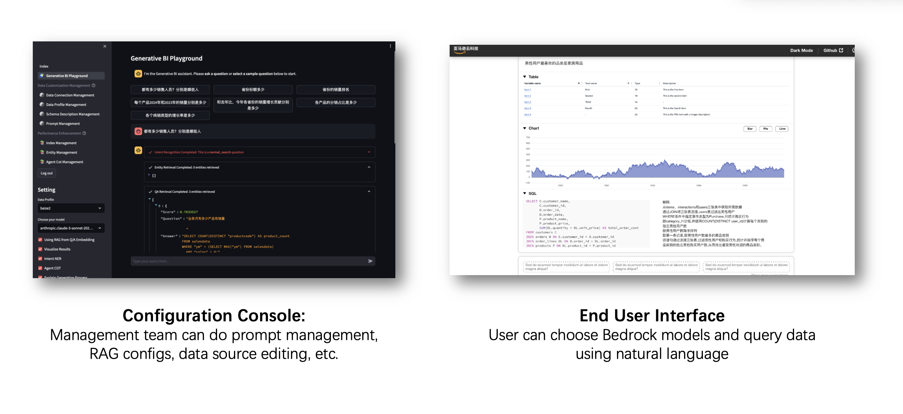
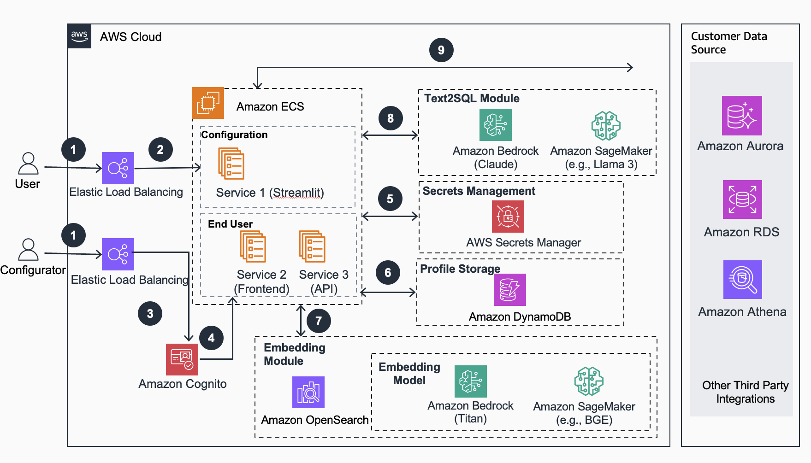
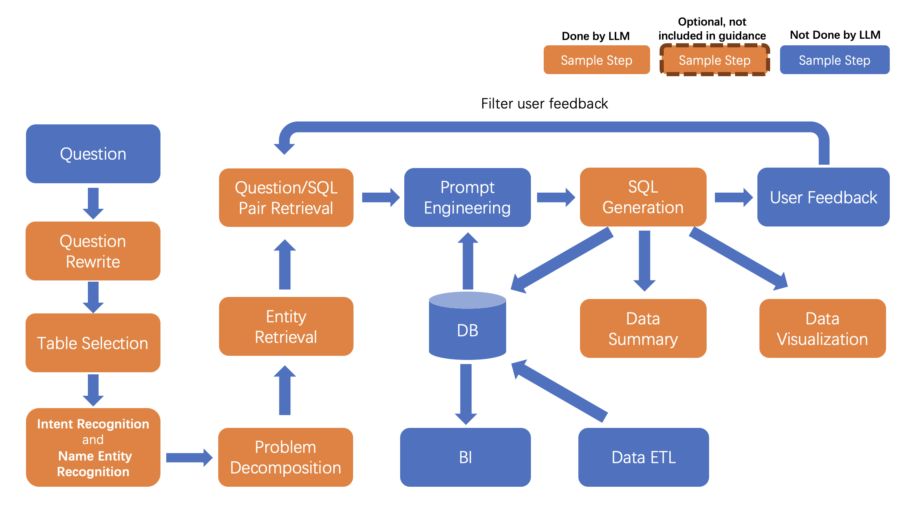

# AWS上でのRAGを使用した生成ビジネスインテリジェンス
[中文文檔](README_CN.md) | [日本語ドキュメント](README_JP.md)

ここに記載されているのはCDKのみの導入ガイドです。手動導入や詳細ガイドについては、[中国語の手動導入ガイド](https://github.com/aws-samples/generative-bi-using-rag/wiki/%E8%B0%83%E8%AF%95%E7%95%8C%E9%9D%A2%E4%BB%A5%E5%8F%8AAPI%E9%83%A8%E7%BD%B2)を参照してください。



## 紹介

Amazon Bedrock、Amazon OpenSearchとRAG技術を使用した生成ビジネスインテリジェンスのデモ。


*AWS上のリファレンスアーキテクチャ*


*設計論理*

[ユーザー操作マニュアル](https://github.com/aws-samples/generative-bi-using-rag/wiki/%E7%B3%BB%E7%BB%9F%E7%AE%A1%E7%90%86%E5%91%98%E6%93%8D%E4%BD%9C)

[プロジェクトデータフローチャート](https://github.com/aws-samples/generative-bi-using-rag/wiki/%E6%9E%B6%E6%9E%84%E5%9B%B3)

## 目次
1. [概要](#overview)
    - [コスト](#cost)
2. [前提条件](#prerequisites)
    - [オペレーティングシステム](#operating-system)
3. [ワークショップ](#workshop)
4. [デプロイ手順](#deployment-steps)
5. [デプロイの検証](#deployment-validation)
6. [ガイダンスの実行](#running-the-guidance)
7. [次のステップ](#next-steps)
8. [クリーンアップ](#cleanup)

## 概要
このフレームワークは、AWSでホストされているカスタムデータソース(RDS/Redshift)に対してGenerative BIの機能を可能にするように設計されています。主な機能は以下の通りです。

- 自然言語を使ってカスタムデータソースを問い合わせるためのText-to-SQLの機能
- データソース、テーブル、列の説明を追加、編集、管理するためのユーザーフレンドリーなインターフェース
- 過去の質問と回答のランキングとエンティティ認識の統合による性能向上
- エンティティ情報、数式、SQLサンプル、複雑なビジネス問題の分析アイデアなどのビジネス情報をカスタマイズ可能
- 複雑な帰属分析問題を処理するためのエージェントタスク分割機能の追加
- 基礎となるText-to-SQLメカニズムの洞察を提供する直感的な質問応答UI
- 対話型アプローチで複雑な質問に対処するためのシンプルなエージェント設計インターフェース

### コスト

2024年5月現在、デフォルト設定でこのガイダンスを_us-west-2_リージョンで実行する場合、2000リクエストを処理するのに約1,337.8ドル/月のコストがかかります。

### サンプルコストテーブル

以下の表は、デフォルトのパラメーターでこのガイダンスをUSイースト(バージニア北部)リージョンに1か月間デプロイした場合のサンプルコスト内訳を示しています。

| AWSサービス | 内訳 | コスト[USD]/月 |
| ----------- | ------------ | ------------ |
| Amazon ECS | vCPU 0.75、5GB | $11.51 |
| Amazon DynamoDB | プロビジョンドライト&リードキャパシティユニット25個/月 | $14.04 |
| Amazon Bedrock | 2000リクエスト/月、リクエストあたり10000入力トークン、1000出力トークン | $90.00 |
| Amazon OpenSearch Service | m5.large.searchインスタンス×1ドメイン | $103.66 |

## 前提条件

### オペレーティングシステム
"CDKは **<Amazon Linux 2023 AMI>** 上で最適に動作するよう最適化されています。他のOSでのデプロイには追加の手順が必要になる可能性があります。"

### AWS アカウントの要件

- VPC
- 特定の権限を持つIAMロール
- Amazon Bedrock
- Amazon ECS  
- Amazon DynamoDB
- Amazon Cognito
- Amazon OpenSearch Service
- Amazon Elastic Load Balancing
- Amazon SageMaker (オプション、カスタムモデルをデプロイする場合)
- Amazon Secrets Manager

### サポートされているリージョン

us-west-2、us-east-2、us-east-1、ap-south-1、ap-southeast-1、ap-southeast-2、ap-northeast-1、eu-central-1、eu-west-1、eu-west-3、またはガイダンスで使用されているサービス(bedrock)がサポートされている他のリージョン。

## ワークショップ

より詳細な使用手順については、以下のワークショップを参照してください。

🔥🔥🔥 [ワークショップコンテンツ](https://catalog.us-east-1.prod.workshops.aws/workshops/37b20322-fc96-4716-8e51-4568b0641448)


## デプロイの手順

### 1. CDK の前提条件を準備する
[CDK ワークショップ](https://cdkworkshop.com/15-prerequisites.html)の手順に従って、CDK ツールキットをインストールしてください。環境にリソースを作成する権限があることを確認してください。

### 2. GenBI 管理ウェブ UI のパスワードを設定する

GenBI 管理ウェブ UI のデフォルトのパスワードは[空白]です。GenBI 管理ウェブ UI のパスワードを設定する必要がある場合は、以下のファイルでパスワードを更新できます。
```application/config_files/stauth_config.yaml```

例:

```yaml
credentials:
  usernames:
    jsmith:
      email: jsmith@gmail.com
      name: John Smith
      password: XXXXXX # ハッシュ化されたパスワードに置き換える
    rbriggs:
      email: rbriggs@gmail.com
      name: Rebecca Briggs
      password: XXXXXX # ハッシュ化されたパスワードに置き換える
cookie:
  expiry_days: 30
  key: random_signature_key # 文字列でなければならない
  name: random_cookie_name
preauthorized:
  emails:
  - melsby@gmail.com
```

パスワード 'XXXXXX' をハッシュ化されたパスワードに変更します。

以下の Python コードを使用して XXXXXX を生成します。Python 3.8 以上が必要です。
```python
from streamlit_authenticator.utilities.hasher import Hasher
hashed_passwords = Hasher(['password123']).generate()
```

### 3. CDK スタックをデプロイする
グローバルリージョンの場合、以下のコマンドを実行します。

CDK プロジェクトのディレクトリに移動:
```
cd generative-bi-using-rag/source/resources
```
CDK スタックをデプロイします。必要に応じてリージョンを変更してください(例: us-west-2、us-east-1 など)。
```
export AWS_DEFAULT_REGION=us-west-1
# パブリック ECR への 403 Forbidden を回避
aws ecr-public get-login-password --region us-east-1 | docker login --username AWS --password-stdin public.ecr.aws
cdk bootstrap
cdk deploy GenBiMainStack --require-approval never
```
デプロイが成功すると、以下のように表示されます。
```
GenBiMainStack.AOSDomainEndpoint = XXXXX.us-west-2.es.amazonaws.com
GenBiMainStack.APIEndpoint = XXXXX.us-west-2.elb.amazonaws.com
GenBiMainStack.FrontendEndpoint = XXXXX.us-west-2.elb.amazonaws.com
GenBiMainStack.StreamlitEndpoint = XXXXX.us-west-2.elb.amazonaws.com
```

## Guidance の実行

CDK スタックがデプロイされた後、初期化が完了するのを約40分待ってから、ブラウザで Web UI を開きます: https://your-public-dns

## クリーンアップ
- CDK スタックを削除する:
```
cdk destroy GenBiMainStack
```